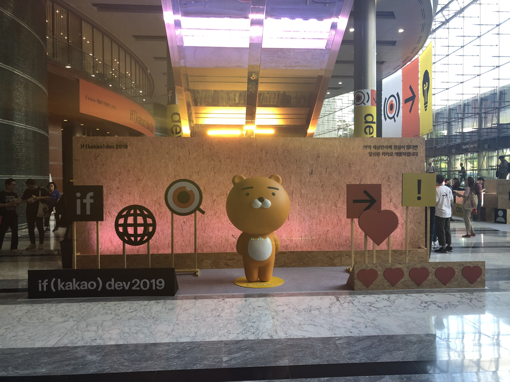
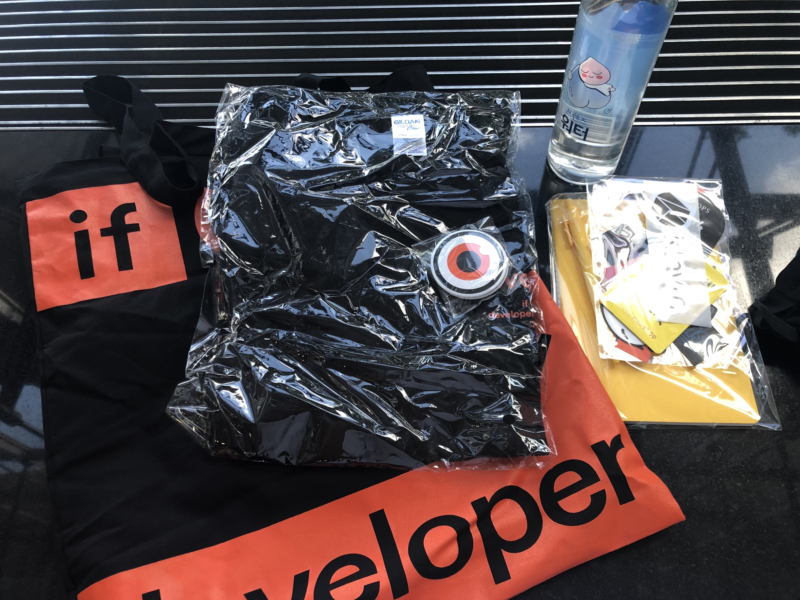
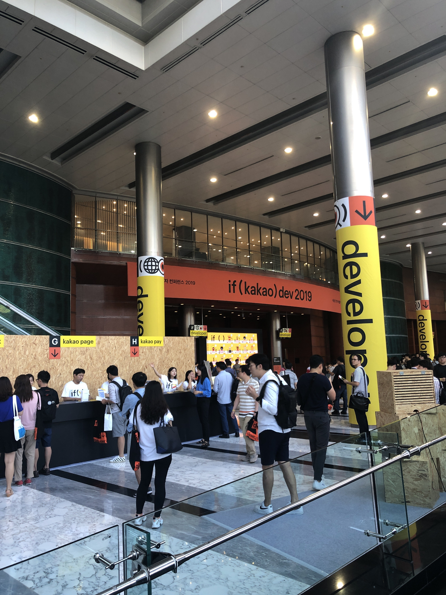
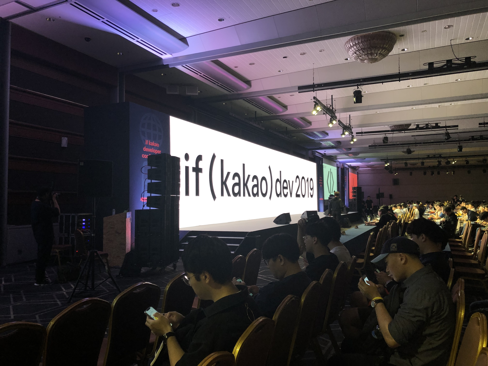

어제 if kakao 2019 2일차에 다녀왔다. 사실 주제는 백엔드 쪽 내용이 별로 없었지만, 그래도 이것저것 흥미롭게 듣고 왔다. 

### 컨퍼런스 입장
   
장소는 코엑스 그랜드 블룸이었다. 
코엑스 정문으로해서 돌아돌아 들어가니 카카오의 마스코트 라이언이 반겨주었다. 
개인적으로는 이제 라이언의 회사라고 해도 무방하지 않을까 싶다. 

    
물론 굳즈도 받았다. 
에코백에 담아서 주셨는 데, 각 자회사 스티커와 티셔츠, 클립형 버튼(?), 노트와 펜, 물이 담겨 있었다. 
이번 컨퍼런스의 톤 앤 매너인 검정과 짙은 주황이 눈에 띄었다. 

 
로비에는 사람이 참 많았다. 
세상 개발자들 다 모여있나 싶었다. 
조그마한 부스에서는 각 자회사들의 채용 설명회 같은 것이 이뤄졌다. 

### 키노트

10시부로 키노트가 진행되었다. 
발표는 AI 부분과 블록체인 부분이 있었다. 
내용을 간단히 정리하자면,

* AI 
    * 이전까지는 사용자가 AI를 접하는 인터페이스에 집중했었다.
    * 이제는 인터렉티브한 AI 서비스에 집중
    * 차세대 프로젝트로 DFLO 진행 중
* 블록체인 (클레이튼)
    * 데이터를 생산하고 관리하는 주체가 기업에서 개인으로 옮겨 갈 것. 그리고 그 중심에 블록체인
    * 현재 다양한 아시아 대기업이 클레이튼 플랫폼에 참여 중
    * 2021년까지 클라우드로 플랫폼 이전하여 다양한 사람이 API로 서비스를 구성, 사용하도록 할 예정
    * KLIP 서비스 진행 중
        * 사용자들의 디지털 자산 관리 서비스
        * 블록체인의 킬러 클라이언트가 될 것이다. 

흥미있던 부분은 클레이튼에서 블록체인이 왜 필요한 지에 대해서 설명해준 부분이었다. 
석사 시절 주요 논문이 개인정보 보호에 관한 내용이었는 데, GDPR과 같이 겹치는 부분이 많아서 더 귀가 쫑긋했다.  
    
블록체인 관련 기조사 내용에서는 *블록체인 플랫폼 기반* 이라는 말이 자주 나왔다. 
이 부분에서 일반 유저 입장에서 뭐가 다를까 궁금해졌고, 기조사가 끝난 후 ground x 부스에 가서 물어봤다. 
답변은 *'사실 일반 유저 입장에서는 크게 달라질 것은 없다. 다만, 데이터에 관한 보증이 블록체인이라는 시스템 자체 내에서 제공 되는 것에서 다르다'* 라고 답변 받았다. 
친절한 답변에 감사했다. 

### 세션  
세션은 ElasticSearch 관련한 세션 2개와 블록체인 최적화, OpenJdk, 오픈소스 관리에 관한 세션을 들었다. 
후반 3개의 세션은 사실 관심이 적은 세션이라 앞에 ES에 관한 내용만 정리했다. 
들으면서 간단히 정리한 내용은 다음과 같다. 

---
#### 세션 1 -  ES 클러스터
##### 히스토리
* 엔드포인트로 사용자에게 제공
* 엔서블을 이용한 배포

##### Advanced Architecture 
* Full GC
	* Deep Aggregation 상황에서 발생
	* 클러스터 내에서 Fail -> 클러스터 전체 Hang
	* 최초 요청 노드 -> 클라이언트 노드 역할도 같아 == 힙 사이즈 두 배
	* --> 데이터 노드와 클라이언트 노드 분리
* 데이터 노드 IDC 이중화
	* **샤드 케어** 필요
* 비용 문제
	* Hot/Warm 데이터 노드 구성
	* 최근 데이터를 자주 보는 경향을 이용한 구성
	* 사용자의 핫 웜 동시 조회 시, 웜의 힙 범위가 더 클 수 있다. 

##### 운영 방법론
* 엔서블을 활용한 배포와 Rolling Restart
	* `serial` 옵션을 이용한 한대씩 재시작 --> 카프카에서도 적용 가능할 듯
* 슬로우 로그 쿼리
	* 로그 스태시가 필터링 과정에서 슬로우 로그 판별하여 걸린시간, 쿼리 등 ES에 저장

##### 샤드 플랜
* ES는 인덱스의 샤드 설정 후 변경 불가
* 잘못된 인덱스 샤드 구성은 디스크 로드 부하 불균형
* 샤드 플랜
	* 샤드 카운트 = 노드 카운트
	* 샤드 카운트 = 노드 카운트 x 2 (증설 시 분배 받기 위해)
	* 핫 노드 와 웜 노드의 최소 공배수로 구성 (핫에서 웜으로 넘어갈 때 불균형 해소)
	* 성능 향상을 위한 
		* 단일 노드 당일 샤드로 구성 뒤 지속적으로 색인, 및 동시에 쿼리 요청. 
		* 검색 응답이 점점 증가하다가 200ms에 도달하면 색인 중지하고(이 때 인덱스 사이즈가 곧 샤드 사이즈), 이 크기를 샤드 크리고 지정

##### 느낀점
* ES 관리에 카카오 톡 봇을 적극 이용 중.
* 데이터 노드와 마스터 노드가 따로 있다니!!
* 인덱스, 핫 웜 구조...

---

#### 세션 2 - 커머스 데이터 엔지니어링 
##### 데이터베이스 인덱스를 ES에 색인 빌드
* 람다 구조 + 복구 (스파크)
* 디비 데이터 변경 감지 
	* CDC 
	* 증분 필드를 pull 하는 방식
		* DBMS에서 변경 감지 지원하는 컬럼 생성
		* 해당 컬럼 인덱스 추가
* 실시간 데이터 변경 처리
	* 기존 : 카프카 - ETL 프로세스 - ES
		* 카프카 순서 보장 안됨
		* 데이터 중복으로 상태 회귀 발생 -> restart 시 오프셋 문제
	* 변경 : 카프카에서 변경되는 식별자만 메세징 -> ETL 에서 식별자로 DB 참조
		* 최종 상태 보장 가능
* 복구
	* 식별자 기준 (시간 기준으로하면 skew data 발생 가능)

##### 정리
* RDBMS 의 인덱스 부분은 ES로 옮겨서 처리한 것 --> Join 부하를 줄이는 것

---

### 정리
규모가 큰 회사의 고민거리는 확실히 무언가 개선하고 성능을 향상하는 것에 집중되어 있는 것 같다. 
나도 계속 내 위치에서 끊임없이 고민해야겠다.  
  

