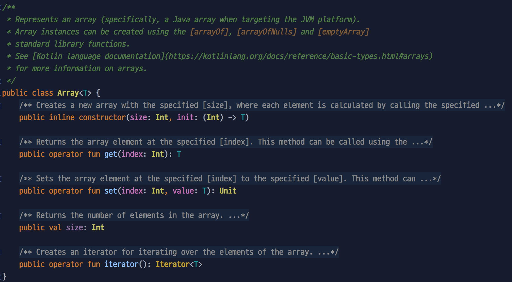
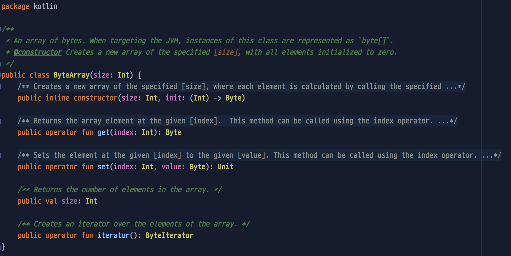

## 코틀린의 Array와 IntArray의 차이점 (feat. 전개 연산자)
코틀린에도 배열 타입이 있다. 
그런데 자바와는 조금 다르게 `Array` 타입과 이와 조금 다르게 `IntArray`, `DoubleArray` 같은 타입이 있다. 
모양새가 비슷한 타입들인데, 어떤 차이점이 있을까? 

### 상속? No!
일반적으로 상속 관계가 아닐까? 할 수 있다. 
하지만 이 두 가지의 클래스는 **전혀 아무 관계가 없다.** 
각각 클래스를 간단히 비교하자면 다음 두 가지 차이점이 있다. 
 
| |`Array`|`XxxArray`|
| :--: | :--: | :--: |
|위치| kotlin.Array.kt | kotlin.Arrays.kt |
|제네릭| o | x |

`Array`의 경우는 Array.kt 파일에 단일 클래스로 존재하며, 제네릭 타입의 클래스이다. 
반면에 `XxxArray`의 경우 Arrays.kt 파일에 여러 타입의 클래스(ex. `IntArray`, `ByteArray` ..)들이 함께 존재한다. 
즉, `Array`의 경우는 제네릭으로 타입을 지정하는 반면, `XxxArray`는 각각 타입마다의 클래스가 제공되는 형태이다. 
이외에 클래스에서 지원하는 함수는 동일하다.

* `Array` 클래스


* `ByteArray` 클래스 (Arrays.kt 파일의 일부분)   
   

### arrayOf<Int>() == intArrayOf() ???
그렇다면 제네릭 타입을 Int로 지정하여 배열을 만드는 `arrayOf<Int>` 배열과 `intArrayOf()`으로 만든 배열을 동일할까? 
결론부터 이야기하면 다르다. 
눈썰미가 빠른 분이라면 위의 사진을 보고 파악했겠지만, 두 타입의 궁극적인 차이는 **자바로 변환했을 때** 나타난다.  
   
{: width="80%" height="80%"}   
*궁금하니 변환해서 살펴보자*   
   
```kotlin
val array = arrayOf(10, 20, 30)
val intArray = intArrayOf(10, 20, 30)
```

두 가지 타입의 배열을 만들었다. 
이 코드를 컴파일하여 자바로 변환된 코드는 다음과 같다(intellij의 decomplie 사용).

```java
Integer[] array = new Integer[]{10, 20, 30};
int[] intArray = new int[]{10, 20, 30};
``` 

그렇다. 
두 타입의 가장 큰 차이점은 자바로 변환되었을 때, 객체 타입의 배열로 변환되느냐 혹은 기초 타입 배열로 변환되느냐 이다. 
위 `ByteArray` 클래스에 관한 그림의 주석 부분을 다시 자세히 봐보면 기초 타입인 `byte` 배열로 변환된다고 설명되어있다. 
   
이 차이점과 관계가 있는 현상으로는 `XxxArray` 타입의 배열은 원소 값으로 `null`을 넣을 수 없다. 
반면에 `Array` 타입의 배열은 `null`이 원소로 들어갈 수 있다. 

### 결론 
이처럼 두 가지 타입의 클래스는 겉보기로는 유사하지만 생각보다 큰 부분에 있어서 차이점을 가지고 있다. 
코틀린을 좀 더 똑똑히 쓰기 위해서는 이런 사소한 점을 잘 알아야겠다. 
   
   
*혹시 부족한 부분은 댓글로 남겨주세요 :)* 