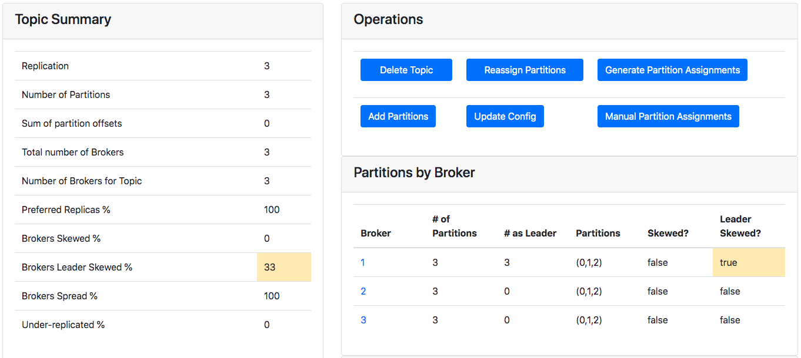
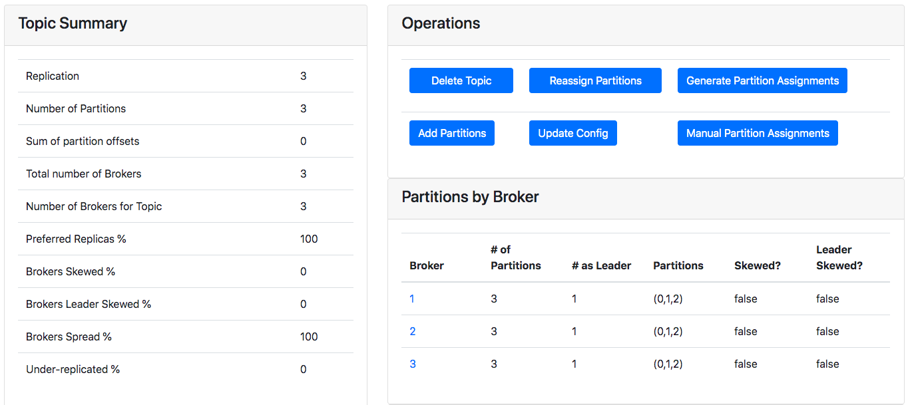

파티션 개수와 복제 계수를 증가시키는 과정에서 파티션 리더가 특정 브로커로 쏠리는(skewed) 현상이 발생했었다. 
왜 발생했는 지 먼저 알아보고 해당 상황을 재현해본다. 

1. [결론](#결론)
1. [이슈 재현](#이슈-재현)
1. [이슈 해결](#이슈-해결)

## 결론
카프카의 복제 파티션 즉, 레플리카는 해당 레플리카가 위치할 브로커를 `[1,2,3]`과 같이 배열 형태로 설정할 수 있다. 
파티션의 리더는 해당 배열에서 첫번째 브로커에 위치하게 된다(즉, `[2,1,3]` 으로 설정되면 `2`번 브로커에 파티션 리더가 위치한다).  
그렇기 때문에 레플리카 설정 과정에서 **레플리카의 순서는 중요하게 고려해야 할 사항이다.**  

이번 이슈는 레플리카 설정 과정에서 모든 파티션의 레플리카 브로커 설정을 동일하게 설정했기 때문에 발생했다.

## 이슈 재현
파티션 및 복제 증가 과정에서 발생한 특정 브로커로 파티션 리더가 쏠리는 이슈 현상을 재현한다. 
과정은 카프카 쉘 명령어를 이용하여 진행했다. 

이슈 재현 과정은 다음과 같다.

1. [토픽 준비](#토픽-준비)
1. [복제 계수 증가](#복제-계수-증가)
1. [파티션 리더 재 선출](#파티션-리더-재-선출)

### 환경

* 도커
* 카프카 3개 (v2.1)
* 주키퍼 1개
* 카프카 매니저

### 토픽 준비 
재현 과정에서 사용할 `test-topic`이라는 토픽을 생성한다. 
파티션은 3개로 설정하고, 복제 계수는 이 후 증가를 위해 `1`로 설정하여 생성한다.  

```
# 토픽 생성
root@d809c2ddbec2:/# kafka-topics --zookeeper zookeeper:2181 --create --topic test-topic --partitions 3 --replication-factor 1
Created topic "test-topic".
```

```
# 토픽 생성 확인 
root@d809c2ddbec2:/# kafka-topics --zookeeper zookeeper:2181 --describe --topic test-topic
Topic:test-topic	PartitionCount:3	ReplicationFactor:1	Configs:
	Topic: test-topic	Partition: 0	Leader: 3	Replicas: 3	Isr: 3
	Topic: test-topic	Partition: 1	Leader: 1	Replicas: 1	Isr: 1
	Topic: test-topic	Partition: 2	Leader: 2	Replicas: 2	Isr: 2
```

생성된 토픽을 확인해보자. 
`Leader` 열을 보면 각 파티션이 3개의 브로커에 하나씩 분배된 것을 확인할 수 있다. 
또한, `Replicas` 열을 보면 각 파티션이 복제본 없이 1개로 구성된 것을 알 수 있다. 

### 복제 계수 증가
복제 계수는 설정 파일(.json)을 통해 증가시킨다. 
사용될 설정 파일을 다음과 같이 생성한다. 

```
# 설정 json 파일 생성
root@d809c2ddbec2:/# cat > increase-replication-factor.json 
{
    "version":1,
    "partitions":[
        {"topic":"test-topic", "partition":0, "replicas":[1,2,3]},
        {"topic":"test-topic", "partition":1, "replicas":[1,2,3]},
        {"topic":"test-topic", "partition":2, "replicas":[1,2,3]} 
    ]
}
```

설정 파일 생성 후, `kafka-reassign-partitions` 명령어를 통해 설정 파일을 이용한 복제 계수 증가시킨다. 
[참고](https://kafka.apache.org/documentation/#basic_ops_increase_replication_factor)

```
# 설정 파일을 이용한 복제 계수 증가
root@d809c2ddbec2:/# kafka-reassign-partitions --zookeeper zookeeper:2181 --reassignment-json-file increase-replication-factor.json --execute
Current partition replica assignment

{"version":1,"partitions":[{"topic":"test-topic","partition":0,"replicas":[3],"log_dirs":["any"]},{"topic":"test-topic","partition":2,"replicas":[2],"log_dirs":["any"]},{"topic":"test-topic","partition":1,"replicas":[1],"log_dirs":["any"]}]}

Save this to use as the --reassignment-json-file option during rollback
Successfully started reassignment of partitions.
```

복제 계수가 적절하게 증가되었는 지를 몇가지 명령어들을 통해 확인한다.  

```
# kafka-reassign-partitions 의 --verify 옵션을 통한 확인
root@d809c2ddbec2:/# kafka-reassign-partitions --zookeeper zookeeper:2181 --reassignment-json-file increase-replication-factor.json --verify
Status of partition reassignment: 
Reassignment of partition test-topic-0 completed successfully
Reassignment of partition test-topic-1 completed successfully
Reassignment of partition test-topic-2 completed successfully

# kafka-topics 를 이용한 확인
root@d809c2ddbec2:/# kafka-topics --zookeeper zookeeper:2181 --describe --topic test-topic
Topic:test-topic	PartitionCount:3	ReplicationFactor:3	Configs:
	Topic: test-topic	Partition: 0	Leader: 1	Replicas: 1,2,3	Isr: 3,1,2
	Topic: test-topic	Partition: 1	Leader: 1	Replicas: 1,2,3	Isr: 1,3,2
	Topic: test-topic	Partition: 2	Leader: 1	Replicas: 1,2,3	Isr: 2,1,3
```

주목할 점은 특이하게 **모든 파티션의 리더가 1번 브로커로 지정되어 있는 것을 확인할 수 있다.** 
이는 카프카 매니저에서도 확인할 수 있다.



**결국 복제는 증가하지만 파티션의 리더가 특정 브로커로 쏠리는 partition leader skewed가 발생하였다.**

### 파티션 리더 재 선출
파티션의 리더를 분배하기 위해 `kafka-preferred-replica-election` 명령어를 이용하여 파티션의 리더를 재 선출을 시도한다. 
[참고](https://stackoverflow.com/questions/26481636/how-to-load-balance-the-kafka-leadership)

```
# 재 선출 요청
root@d809c2ddbec2:/# kafka-preferred-replica-election --zookeeper zookeeper:2181
Created preferred replica election path with __consumer_offsets-22,test-topic-2,...
Successfully started preferred replica election for partitions Set(__consumer_offsets-22,test-topic-2,...)
```

파티션 리더의 재 선출 과정을 진행했지만, **여전히 쏠림 현상이 유지되는 것을 확인할 수 있다.** 

```
# 결과 확인
root@d809c2ddbec2:/# kafka-topics --zookeeper zookeeper:2181 --describe --topic test-topic
Topic:test-topic	PartitionCount:3	ReplicationFactor:3	Configs:
	Topic: test-topic	Partition: 0	Leader: 1	Replicas: 1,2,3	Isr: 3,1,2
	Topic: test-topic	Partition: 1	Leader: 1	Replicas: 1,2,3	Isr: 1,3,2
	Topic: test-topic	Partition: 2	Leader: 1	Replicas: 1,2,3	Isr: 2,1,3
```

## 이슈 해결
파티션의 리더는 카프카 레플리카의 설정 순서에 따라 결정된다. 
그런데 처음 복제 설정 과정에서 모든 파티션의 레플리카 순서를 `[1,2,3]` 로 설정했기 때문에, 파티션 리더 분배 시 1번 브로커가 모든 파티션의 리더가 된 것이다. 

```
# 이전 레플리카 설정 json 파일
{
    "version":1,
    "partitions":[
        {"topic":"test-topic", "partition":0, "replicas":[1,2,3]},
        {"topic":"test-topic", "partition":1, "replicas":[1,2,3]},
        {"topic":"test-topic", "partition":2, "replicas":[1,2,3]} 
    ]
}
```

그래서 레플리카 순서를 재 설정하고, 파티션 리더를 적절히 분배하기 위해 다음과 같이 진행한다. 

1. 레플리카 json 설정 파일 수정
1. 설정 파일 적용
1. 파티션 리더 재 선출

```
# 레플리카 설정 파일 수정
root@d809c2ddbec2:/# cat > increase-replication-factor.json 
{
    "version":1,
    "partitions":[
        {"topic":"test-topic", "partition":0, "replicas":[1,2,3]},
        {"topic":"test-topic", "partition":1, "replicas":[2,1,3]},
        {"topic":"test-topic", "partition":2, "replicas":[3,1,2]} 
    ]
}
```

```
# 레플리카 설정 파일 적용
root@d809c2ddbec2:/# kafka-reassign-partitions --zookeeper zookeeper:2181 --reassignment-json-file increase-replication-factor.json --execute
Current partition replica assignment

{"version":1,"partitions":[{"topic":"test-topic","partition":2,"replicas":[1,2,3],"log_dirs":["any","any","any"]},{"topic":"test-topic","partition":1,"replicas":[1,2,3],"log_dirs":["any","any","any"]},{"topic":"test-topic","partition":0,"replicas":[1,2,3],"log_dirs":["any","any","any"]}]}

Save this to use as the --reassignment-json-file option during rollback
Successfully started reassignment of partitions.

# 레플리카 설정 변경 확인
root@d809c2ddbec2:/# kafka-topics --zookeeper zookeeper:2181 --describe --topic test-topic
Topic:test-topic	PartitionCount:3	ReplicationFactor:3	Configs:
	Topic: test-topic	Partition: 0	Leader: 1	Replicas: 1,2,3	Isr: 3,1,2
	Topic: test-topic	Partition: 1	Leader: 1	Replicas: 2,1,3	Isr: 1,3,2
	Topic: test-topic	Partition: 2	Leader: 1	Replicas: 3,1,2	Isr: 2,1,3
```

```
# 파티션 리더 재 선출
root@d809c2ddbec2:/# kafka-preferred-replica-election --zookeeper zookeeper:2181
Created preferred replica election path with __consumer_offsets-22,test-topic-2,...
Successfully started preferred replica election for partitions Set(__consumer_offsets-22,test-topic-2,...)

# 파티션 리더 분배 확인
root@d809c2ddbec2:/# kafka-topics --zookeeper zookeeper:2181 --describe --topic test-topic
Topic:test-topic	PartitionCount:3	ReplicationFactor:3	Configs:
	Topic: test-topic	Partition: 0	Leader: 1	Replicas: 1,2,3	Isr: 3,1,2
	Topic: test-topic	Partition: 1	Leader: 2	Replicas: 2,1,3	Isr: 1,3,2
	Topic: test-topic	Partition: 2	Leader: 3	Replicas: 3,1,2	Isr: 2,1,3
```

이를 통해 파티션 리더가 각 브로커에 고르게 분포시킬 수 있었다. 
이는 카프카 매니저를 통해서도 확인할 수 있다.




끝.

독자분들의 피드백은 언제나 환영입니다! :) 
