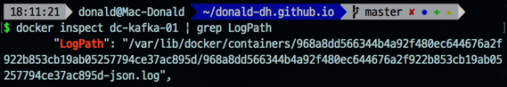
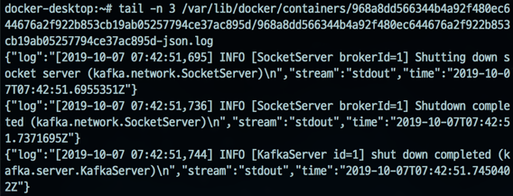

## 들어가며
로컬에 도커(v19.03.2)로 카프카 클러스터를 구성하여 사용 중이다. 
그러다 문득 카프카 브로커가 발생시키는 로그는 어디서 확인할 수 있을까? 궁금증이 생겼다. 
GUI 툴인 `portainer`를 사용하거나 `docker logs` 명령어로 확인할 수 있었지만, 실제 로그 파일이 어디에 쌓이는 지 알고 싶었다. 
또 그래야 이 후에 수집하거나 모니터링할 때 유용할 것 같았다.
각설하고, **Mac os 환경에서 도커 컨테이너의 로그가 어디에 쌓이는 지 알아보고, 직접 접근해보자.** 

## 준비 
로컬에서 카프카 클러스터를 다음과 같이 구성하고 있다. 

구성된 카프카 클러스터 중 `dc-kafka-01` 컨테이너에서 발생하는 로그를 저장하는 로그 파일에 접근해보자.

## 로그 디렉토리 위치 확인
도커의 `docker inspect {container_name}` 명령어는 해당 컨테이너의 정보를 확인하 수 명령어이다. 
**해당 컨테이너의 로그 디렉토리 또한 이 명령어를 통해 확인할 수 있다.** 
참고로 무수히 많은 정보가 나오니, 잘 찾아야 한다(사진과 같이 `grep LogPath` 명령어를 추가하는 것을 추천한다.). 

도커 로그는 기본적으로 json 형태로 저장한다([참고: 도커 로깅 드라이버](https://docs.docker.com/config/containers/logging/plugins/)). 
해당 컨테이너도 별도의 로깅 드라이버 설정 없이 생성했기 때문에 *기본적으로 json 형태로 저장한다.* 
`LogPath`를 알았으니 본격적으로 로그를 찾아보자. 

없다..?(*눼?*)

### 트러블 슈팅 
경로를 그대로 복사했는 데도 나타나지 않았다. 
무언가 잘못된 것 같아서 지식의 요람 stackoverflow 에서 찾아봤더니, 나와 [똑같은 질문 글](https://stackoverflow.com/questions/48180981/docker-container-log-file-not-found-on-mac)이 있었다. 
해당 질문 글의 답변은 다음과 같았다.  

 

답변에 나온 디렉토리에 먼저 접근해봤다. 

디렉토리를 살펴보니 답변 글처럼 마지막 줄에 `tty` 파일이 존재했다. 
tty에 관해서 살펴보니 터미널과 같은 개념이었다. 
그리고 답변 글의 명령어인 `screen`도 가상 터미널 접속과 관련된 명령어였다. 
즉, **가상화된 도커 파일 시스템에 접속해야 한다는 뜻이었고, `LogPath`의 값도 도커 FS에서의 path인 것이었다.** 

`screen tty` 를 통해 접속해보고(각주 1), `LogPath` 경로에 있는 디렉토리로 접근해봤더니 실제로 `.json`된 로그 파일이 존재하는 것을 알 수 있었다.  
또한, `tail -n ` 명령어를 통해 접근해봐도 해당 로그 파일이 카프카 컨테이너의 로그 파일임을 확인할 수 있었다. 

  

### 마무리
위 과정을 통해 도커 컨테이너의 로그가 저장되는 로그 파일의 위치를 접근할 수 있었다. 
다만, 원래 목적에는 컨테이너의 로그에 접근하여 수집하는 것까지 생각하고 있었는 데, 가상 환경에 존재해서 파일 자체로 수집하기는 어렵지 않을까 싶다(*지레짐작*). 
도커에서는 다양한 로깅 드라이버를 제공하고 있으니, 그것을 참고해봐야겠다.

### 각주 
1. `screen` 명령어로 가상 터미널에 접속했을 때 아무것도 나타나지 않는다면, `CTRL + c` 명령어를 입력하여 프로세스를 중단시키면 정상적인 터미널 화면이 나타난다. 
 

