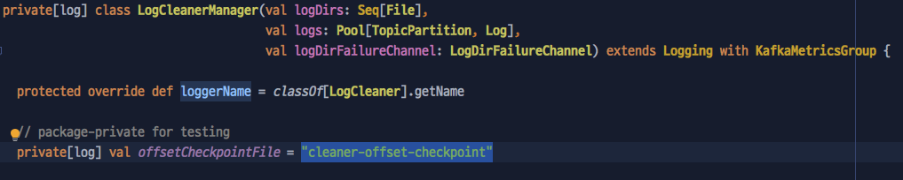

## 문제 발생과 파악  
브로커를 죽이고 살리며 이것저것 해보고 있는 중이었다. 
이 후에 브로커 로그를 확인해보니 다음의 `WARN` 로그가 대략 15초 간격으로 대량으로 쌓여있었다.

```console
[2019-09-25 01:17:37,919] WARN Resetting first dirty offset of __consumer_offsets-31 to log start offset 195 since the checkpointed offset 191 is invalid. (kafka.log.LogCleanerManager$)
``` 

로그를 해석해보면 다음과 같다(맞나..?).

> 체크포인트된 오프셋 `191`이 유효하지 않아서 `__consumer_offsets-31`의 첫번째 Dirty 오프셋을 로그 시작 오프셋인 `195`로 재설정한다.

게다가 해당 로그의 발생 위치가 `kafka.log.LogCleanerManager`이다. 
로그 내용과 발생 위치를 바탕으로 짐작해봤을 때, 로그 클린(`cleanup`)과정에서 무언가 문제가 발생한 듯 했다. 

## 원인 - 로그 압축 
로그 유지 관련된 설정(`cleanup.policy`)에는 삭제와 압축가 있다. 
삭제(`delete`)는 말 그래도 유효 기간이 지난 로그들은 모두 삭제하는 설정이다. 
압축(`compact`)은 컨슈머에 의해 소비되고 있는 가장 최근의 오프셋만 남기고 삭제하는, 즉 압축하는 설정이다. 

   

압축으로 설정된 오프셋은 그림과 같이 `Tail`과 `Head` 부분으로 나눠지는데, 
`Tail`은 `Clean`으로도 불리며 압축 처리된 오프셋 부분을 나타내고, `Head`는 `Dirty`로도 불리며 압축 처리가 안된 최근 로그 부분을 나타낸다. 
확인해본 결과, 카프카의 오프셋 토픽(`__consumer_offsets`)은 로그 유지 설정이 압축으로 설정되어 있기 때문에, 
문제의 로그에서 Dirty도 이 상황을 나타낸 것으로 짐작된다.

위 내용을 바탕으로 문제 상황을 조금 더 추리해봤다. 

> LogCleanerManager가 어딘가에 체크된 오프셋(191)을 기반으로 로그 압축을 진행하려고 했는데,
해당 오프셋이 유효하지 않은 상태(소실?)여서 가장 최근의 로그 오프셋(195)으로 재설정하려고 했던 것이다.  

## 해결 - cleaner-offset-checkpoint
로그 발생 지점의 [카프카 코드](https://github.com/apache/kafka/blob/trunk/core/src/main/scala/kafka/log/LogCleanerManager.scala#L517)를 확인해봤더니, 
`cleaner-offset-checkpoint` 파일에 명시된 오프셋과 로그 파일의 시작 오프셋을 비교하는 과정에서 로그가 발생했다. 




`cleaner-offset-checkpoint` 파일은 로그들이 저장되는 `logs` 폴더 내부에 존재했고, 내용은 다음과 같았다. 

```
0
2
__consumer_offsets 31 191
__consumer_offsets 29 4
```

문제에 로그의 주인공인 `__consumer_offsets-31`이 191 값으로 명시된 것을 확인할 수 있었다. 
해당 라인의 값을 195로 수정하였더니, 이 후로는 문제의 로그가 발생하지 않았다. 

## 마무리 & TODO
문제 해결 후, 문제 상황을 다시 재현하기 위해 `cleaner-offset-checkpoint` 파일을 임의로 수정했는데, 이 과정 중 브로커가 셧다운되는 상황이 발생했다. 
그만큼 해당 파일 매우 민감한 것 같다. 
그래서 **위 방법이 적절한 해결 방법인지 확인이 필요하다.** 

또한 [카프카 코드의 `isCampactAndDelete(log)`](https://github.com/apache/kafka/blob/trunk/core/src/main/scala/kafka/log/LogCleanerManager.scala#L530) 부분에서 로그가 발생하는데, 
`cleanup.policy`를 `compact`와 `delete` 모두로 주면 로그가 발생하지 않고 *정상적으로* 처리될 지도, 또 그러면 *왜 정상적인지도* 궁금하다.


부족한 내용은 많은 피드백 부탁드립니다. :)