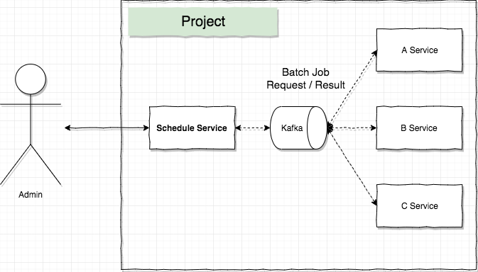
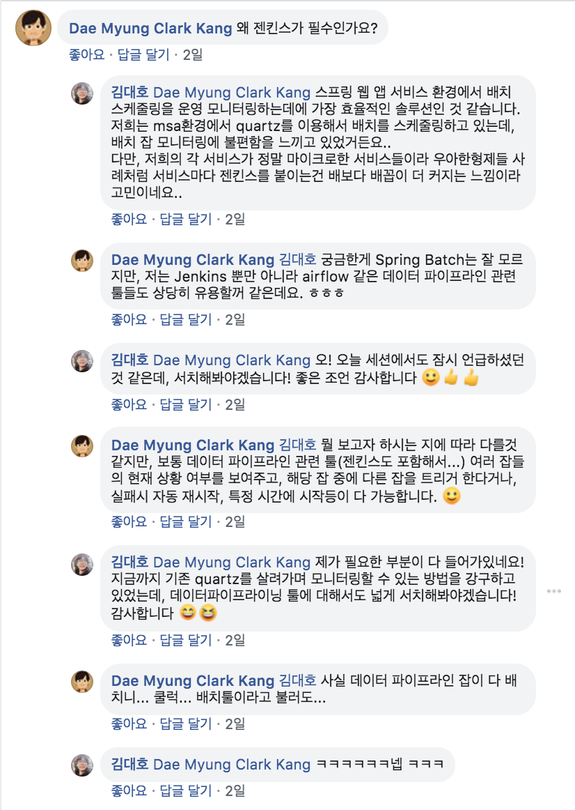

이 글은 우아한 스프링 배치에 대한 후기(30%)와 배치 잡 관리에 관한 고민 해결 과정 글(70%)로 구성되어 있습니다.  

세션 내용에 관심이 있으면, [세션 내용](#세션-내용) 단락을 중심으로 보는 것을 추천합니다. 

## 들어가며 
기존에 진행했던 프로젝트들은 MSA 환경에서 진행되었다. 
그래서 서비스들은 도메인을 기준으로 작게 나눠져있었고, 나눠진 서비스들은 0~3개 정도의 배치 작업이 실행되어야 했다. 
배치 작업은 스프링 배치와 [Quartz(콰츠)](http://www.quartz-scheduler.org/)를 이용해서 처리됐다. 
하지만, 처리 과정에서 스케줄링을 위해 콰츠 스키마 관리, 스케줄러 객체 생성 등 생각보다 공수가 많이 들어갔다. 
**핵심은 배치 잡의 로직인데 말이다.**

그래서 차후 프로젝트 적용을 위해 **스케줄링 작업만 담당하는** 별도의 *스케줄 서비스*를 개발하고 있었다. 
스케줄 서비스는 프로젝트에 포함된 서비스들의 모든 스케줄을 관리하는 형태로 기획됐다. 
추가로 Admin 페이지도 만들어서 모니터링도 가능케하려고 했다. 

 
그런데 구현 과정에서 파라미터 전달, 장애 시 알람 기능, 모니터링 페이지 만들기 등 상당한 공수가 필요했고, 
혼자 개발하는 입장에서 자신감도 부족했다. 
 
이런 고민 중에 우아한 형제들에서 스프링 배치에 관한 세션이 있다는 것을 알게 되었고, 
우아한 형제들에서는 어떻게 이런 고민을 해결했는지? 
그리고 내가 지금까지 했던 배치 프로세스가 적절했는 지에 대해 알아보고자 등록했다(운이 좋게 당첨!). 

 

## 세션 내용
세션의 연사님은 내가 스프링 배치를 개발할 때 참 많이 참고했던 [블로그](https://jojoldu.tistory.com/)의 주인장님이신 이동욱님께서 맡아 진행됐다. 
세션은 스프링 배치의 기본편과 활용편으로 진행됐다. 

### 기본편
스프링 배치에 대한 기본적인 내용이 중심이었다. 
그동안 개발하면서 잘 공부한(?) 건지 비교적 가볍게 들을 수 있었지만, 
그래도 놓쳤던 중요한 포인트는 몇가지 있었다. 

1. 배치 작업은 요청-응답이 아닌 독립적인 작업
1. 배치 로직에 변할 수 있는 부분은 무조건 Job Parameter로 주입한다.(멱등성 유지) 
1. 스프링 배치는 QA 과정이 복잡하기 때문에 무조건 테스트 코드 작성!!
1. Read 과정에서 `findAll()` 등으로 모두 메모리에 올리지 않는다.

어쩌면 당연한 것일 수 있지만, 중요하게 생각하지 않았던 부분인 것 같다. 
특히 3번은 오히려 `내가 개발하며서 테스트 해봤으니까` 라며 넘어간 부분이 많았다. 
앞으로는 그러지 말자.

### 활용편
활용편은 크게 2가지 맥락으로 진행됐다(내 기억으로는). 

1. Job Parameter 관리
2. **스프링 배치의 운영과 모니터링**

Job Parameter(잡 파라미터) 관리에 관한 내용은 지원하지 않는 타입에 대하여 어떻게 풀이할 것인가에 초점이 맞춰져 있었다. 
아무래도 스프링 배치에서 지원하는 잡 파라미터 타입이 4가지 밖에 되지 않아, 이외의 타입들은 바인딩하기 어려웠기 때문이다. 
세션에서는 `@Value`와 getter를 이용한 잡 파라미터 빈(`Bean`)을 별도로 생성해서 주입, 바인딩 시키는 것으로 처리를 권장했다. 

스프링 배치의 운영과 모니터링 부분은 말 그대로 스프링 배치 잡을 어떻게 운영 관리할 것인가에 대한 내용이었다. 
내 고민의 중심을 다루던 해당 내용의 중심은 [젠킨스(`Jenkins`)](https://jenkins.io/)였다. 
젠킨스로 배치 잡을 스케줄링하는 아키텍쳐와 배치 잡 등록 과정 중에 처리해줘야하는 공통 설정 등에 대해 설명해주셨다. 

### QnA
나 포함 2~3명의 QnA가 있었는데, 내 것밖에 기억이 나지 않는다..

> Q. MSA 환경에서도 젠킨스로 배치 처리하는 것이 적절한 지? 그리고 혹시 주의해야할 점이 있는 지?

> A. 충분히 적절하다. 우아한 형제들에서도 MSA 환경에서 개발하고 있으며, 
> **통합 젠킨스가 아닌 각 서비스마다 젠킨스가 붙어 배치 작업을 처리하고 있다.**  

## 세션 종료 후..
세션을 통해서 배치 잡에 대한 것들을 다시 한번 되집을 수 있었다. 
하지만 해결하려고 했던 고민은 더 늘어난 느낌이었다.

### MSA와 젠킨스 

> 배치 로직과 스케줄링 작업의 분리를 어떻게 할 것인가?

> 통합으로 스케줄링을 관리하면 안되는 것인가?

우아한 형제들은 위 문제를 서비스 별 젠킨스를 통해 풀었다. 
그래서 *우리도 기존에 개발하던 통합 스케줄 서비스 대신 서비스 별 젠킨스를 적용하면 될까?* 라는 생각을 해봤다. 

하지만 기존 우리 상황에서 각 서비스마다 젠킨스를 붙이는 것은 **배보다 배꼽이 더 커질 것 같은 느낌이었다.** 
우아한 형제들은 각 서비스(결제, 회원 등)가 서비스 별로 젠킨스가 붙을만큼 충분히 클 것이지만, 
내가 이전까지 개발했던 서비스는 정말 마이크로(micro) 했기 때문이다. 

이런 고민을 페이스북에 조그맣게 남겼더니 강대명님께서 댓글을 달아주셨다.
 

댓글을 통해 젠킨스보다 가벼운(?) Airflow 라는 배치 툴을 추천 받을 수 있었다. 
하지만 고민을 완벽히 해결할 수 있는 것은 아니었다. 

> 서비스마다 배치 툴을 붙이면 여전히 배보다 배꼽이 커지는 모습...
 
> 그렇다고 중앙에서 관리하면,,, **MSA 관점에서는 쪼개지는 것이 핵심인데..**

### 고민 해결!! feat. 갓대명님 
결국엔 강대명님께 메신저로 위 고민에 대해 여쭤봤다. 
그리고 다음과 같은 생각의 흐름으로 해결할 수 있었다(실제로 이런 대화가 오고간 것은 아니다). 

* 스케줄링 앱을 통해 배치 로직과 스케줄링을 나누고자 한다.
    * 그러면 굳이 스케줄링 앱이 필요할까? 젠킨스(배치 툴) 쓰면 되겠네?!
* 그런데 MSA 관점에서 중앙에서 관리하면 안좋지 않나? 실패 전파라던지..
    * 배치 작업이 안돈다고 서비스가 실패하나? 배치는 독립적인데?
    * 결국은 **배치 잡의 운영과 관리가 편하고자 하는 것이 목표인데?**
    
그렇다. 
MSA 라는 틀에 갇혀, 내가 결국 뭘 해결하고자 했는 지에 잊어버린 것이다. 
**내 고민의 핵심은 기존 배치 잡에서 어떻게 스케줄링 공수를 걷어낼 것이고, 어떻게 운영 관리를 더욱 쉽게할 수 있을까?** 였다. 
그리고 최종적인 결론은 다음 같이 내릴 수 있었다. 

> 젠킨스 같은 배치 툴을 적용하는 것이 기존 내가 개발하던 스케줄 서비스와 동일한 형태이며, 오히려 직접 개발하는 것보다 더 좋은 방법일 것이다. 
> 그리고 아무리 MSA 환경이라도 중앙에서 관리하든, 각 서비스에 붙이든 운영 관리가 편한 형태이면 그만일 것이다.

## 느낌점과 TODO 
이번 과정을 통해 **고민 해결에 앞서 문제를 명확하게 정의하는 것이 중요하다는 것**을 느꼈다. 

그리고 젠킨스와 에어플로우에 관해서 서치해보고 다음 프로젝트에 적용할 수 있도록 잘 정리해야겠다. 

*고민 해결에 큰 도움 주신 강대명님께 다시 한번 감사드립니다.*