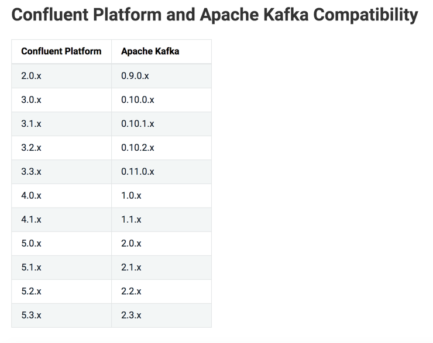
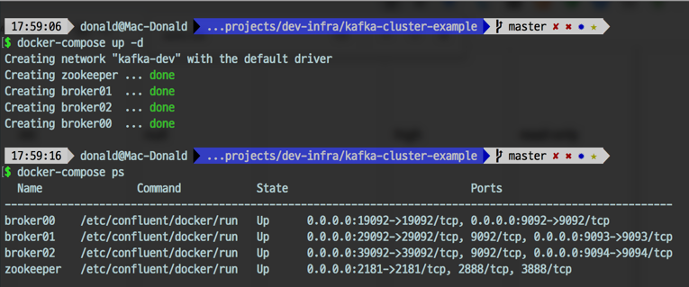

### 들어가며  
로컬 환경에서 개발을 진행하다보면, 카프카 클러스터가 필요한 경우가 있다. 
이 글은 카프카 시리즈 1탄으로 `docker-compose` 를 이용하여 로컬 환경에 카프카 클러스터 설치하는 방법을 알아본다. 
카프카 클러스터는 **주키퍼(zookeeper) 1 대와 카프카 3 대**로 이뤄진다. 
이 글은 카프카 클러스터 설치에 집중되어 있기 때문에 도커에 관한 지식은 다루지 않는다. 

### 사용 이미지  
설치에 사용할 이미지는 상용 카프카 솔루션을 제공하는 [Confluent(이하 컨플런트)](https://www.confluent.io/) 사에서 배포한 이미지를 사용한다. 
컨플런트는 상용 카프카 플랫폼을 제공하는 업체이지만, 기본적인 카프카 클러스터 구성 요소에 대해서는 오픈된 이미지를 제공하고 있다. 
무엇보다도 오리지널 카프카 개발자들이 세운 회사이기 때문에 기술력을 보장할 수 있다. 

다음은 설치에 사용할 이미지 목록이다. 
각 이미지의 버전은 게시 기준 가장 최근 버전인 `5.3.1` 버전을 사용한다. 
해당 버전은 아파치 카프카 `2.3.x` 버전을 제공한다.  

* 카프카 : [cp-kafka](https://hub.docker.com/r/confluentinc/cp-kafka)
* 주키퍼 : [cp-zookeeper](https://hub.docker.com/r/confluentinc/cp-zookeeper)



### 클러스터 구조와 브로커 설정 
카프카 클러스터는 다음과 같은 구성으로 설치할 것이다. 

* 주키퍼 x 1
* 카프카 브로커 x 3
* 모든 노드는 `kafka-dev` 네트워크로 구성
* 외부 통신 가능하도록 포트 포워딩

또한 각 카프카 브로커는 다음 옵션을 추가하여 설치한다. 

* 브로커는 내부 리스너와 외부 리스너로 2개의 엔드 포인트를 노출
* 모든 리스너는 보안을 적용하지 않는다. 
* 브로커의 자동 토픽 생성 옵션을 사용한다. 

### docker-compose 작성
위 구조와 브로커 설정을 바탕으로 구성된 docker-compose.yml 파일은 다음과 같다. 
전체 코드는 [관련 레포지토리](https://github.com/donald-dh/kafka-study/blob/master/src/kafka-cluster/docker-compose.yml)를 통해 공개한다. 

```
# kafak-cluster
# https://donald-dh.github.io/donald-dh.github.io/kafka-docker-setup

version: '3.5'
services:
  zookeeper:
    image: confluentinc/cp-zookeeper:5.3.1
    container_name: zookeeper
    ports:
      - "2181:2181"
    environment:
      ZOOKEEPER_CLIENT_PORT: 2181
    networks:
      - kafka-dev

  broker00:
    image: confluentinc/cp-kafka:5.3.1
    container_name: broker00
    depends_on:
      - zookeeper
    ports:
      - '9092:9092'
      - '19092:19092'
    environment:
      KAFKA_BROKER_ID: 1
      KAFKA_ZOOKEEPER_CONNECT: zookeeper:2181
      KAFKA_LISTENERS: INTERNAL_LISTENER://broker00:19092,EXTERNAL_LISTENER://broker00:9092
      KAFKA_ADVERTISED_LISTENERS: INTERNAL_LISTENER://broker00:19092,EXTERNAL_LISTENER://localhost:9092
      KAFKA_LISTENER_SECURITY_PROTOCOL_MAP: INTERNAL_LISTENER:PLAINTEXT,EXTERNAL_LISTENER:PLAINTEXT
      KAFKA_INTER_BROKER_LISTENER_NAME: INTERNAL_LISTENER
      KAFKA_AUTO_CREATE_TOPICS_ENABLE: 'true'
    networks:
      - kafka-dev
...
```

중요한 몇가지 옵션에 대해 설명한다. 

* `ZOOKEEPER_CLIENT_PORT` (필수) : 주키퍼의 포트를 설정한다.
* **`KAFKA_BROKER_ID`** (필수) : 브로커의 아이디를 지정한다. 각 브로커는 서로 다른 아이디를 가져야한다.
* `KAFKA_LISTENERS` (선택) : 카프카 통신을 위한 리스너를 설정한다. 해당 옵션을 설정하지 않으면 `KAFKA_ADVERTISED_LISTENERS` 을 바탕으로 설정된다. 
* **`KAFKA_ADVERTISED_LISTENERS`** (필수) : 카프카를 바라보는 클라이언트가 카프카 리스너와 통신을 위해 바라볼 설정이다. 쉽게 말해 **외부에서 카프카를 바라볼 때의 엔드 포인트를 설정하면 된다.** 
* `KAFKA_LISTENER_SECURITY_PROTOCOL_MAP` (필수) : 리스너에 대한 보안 설정이다. `PLAINTEXT`는 보안을 설정하지 않는 옵션이다. 
* `KAFKA_INTER_BROKER_LISTENER_NAME` (부분 필수) : 클러스터 내부의 브로커 간 통신을 위한 리스너를 명시해주는 옵션이다. **리스너가 복수 개일 경우 반드시 설정해줘야 한다.** 
* `KAFKA_AUTO_CREATE_TOPICS_ENABLE` (선택) : 토픽 자동 생성에 관한 옵션이다. 기본 값이 `true` 이기 때문에 굳이 명시해주지 않아도 된다. 

카프카 리스너를 2개로 둔 이유는 `INTERNAL_LISTENER`는 카프카 내부 통신을 위한 리스너이고, `EXTERNAL_LISTENER`는 카프카 외부 클라이언트를 위한 리스너이기 때문이다. 
만약 스프링와 카프카 클러스터를 연동할 경우, 스프링은 `EXTERNAL_LISTENER` 를 통해 카프카 클러스터와 통신하게 된다. 

### 클러스터 구성
작성된 docker-compose.yml 디렉토리에서 `docker-compose up -d` 명령어를 통해 카프카 클러스터를 빌드한다. 
카프카는 주키퍼가 실행되야 실행될 수 있기 때문에, **가끔 주키퍼 실행이 늦어 카프카 브로커가 잠시 실행됐다가 바로 죽을 수 있다**(`depends_on` 옵션을 걸어도). 
그렇기 때문에 up 명령어 후, 약 30초 정도 시간 후에 `docker-compose ps` 명령어를 통해 정상적으로 빌드되었는 지 확인해본다. 



### 마무리
docker-compose 을 통해 주키퍼와 카프카 브로커로 구성된 카프카 클러스터를 구성했다. 
이 후는 구성된 클러스터를 보다 관리하기 쉽도록 **Kafka Manager(카프카 매니저)** 를 붙혀보도록 하겠다. 

 