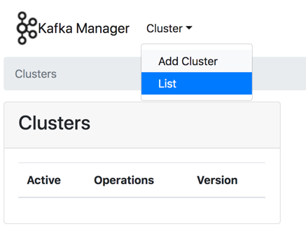
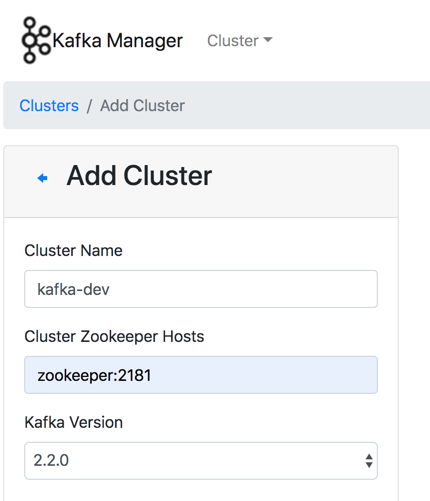
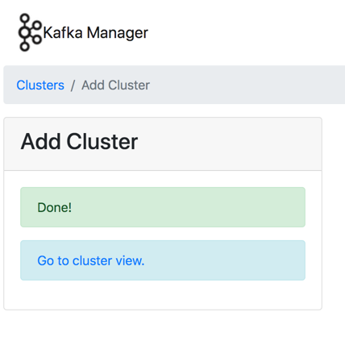

## 들어가며 
[이전 포스트](2019-10-13-kafka-docker-setup.md)에서는 docker-compose 명령어를 통해 카프카 클러스터를 구성해봤다. 
구성된 카프카 클러스터는 개발 간 다양한 요구사항에 맞춰 운영될 것이다. 
하지만 이런 운영을 단순한 CLI 환경에서 다루는 것은 쉽지 않은 일이다. 
그렇기 때문에 이번 글에서는 **보다 간편한 카프카 클러스터 운영을 위해 카프카 관리 웹 UI 툴인 카프카 매니저(kafka manager)를 연동해본다.** 

## 사용 이미지 
카프카 매니저를 구성하는 것에는 `hlebalbau/kafka-manager:stable` 이미지를 사용한다. 
도커 허브에는 카프카 매니저에 관련한 이미지가 몇 개 있지만, 개인적으로는 업데이트, 환경 설정 등에 있어서 가장 낫다고 판단하여 해당 이미지를 사용한다. 

태그는 `latest`도 있지만, 카프카 매니저의 릴리즈에 맞춰져있는 `stable` 태그를 사용한다. 
둘 차이는 다음과 같다. 

* stable: 카프카 매니저 레포지토리의 릴리즈를 기반으로 빌드
* latest: 마스터 브런치를 기반으로 주기적으로 빌드. 프로덕션 환경에서는 추천하지 않음.

## docker-compose.yml 작성
작성되는 docker-compose.yml 파일은 [이전 포스트](2019-10-13-kafka-docker-setup.md)에서 작성한 스크립트에 카프카 매니저 부분을 추가한다. 
전체 스크립트는 [다음 링크](../codes/20191015/docker-compose.yml)을 참고한다. 

```yaml
...
  kafka-manager:
    image: hlebalbau/kafka-manager:stable
    container_name: kafka-manager
    depends_on:
      - zookeeper
    ports:
      - "9000:9000"
    environment:
      ZK_HOSTS: zookeeper:2181
      KAFKA_MANAGER_AUTH_ENABLED: "true"
      KAFKA_MANAGER_USERNAME: username
      KAFKA_MANAGER_PASSWORD: password
    networks:
      - kafka-dev
...
```

몇 가지 설정에 대해 설명한다. 

* `depend_on` : 카프카 브로커와 마찬가지로 주키퍼가 실행된 후 컨테이너를 실행한다. 
* `port` : 웹으로 접속할 포트를 지정한다. 카프카 매니저의 기본 포트는 9000 이다.
* `environment` 
    * `ZK_HOSTS` : 연동할 주키퍼 url 을 입력한다. 
    * `KAFKA_MANAGER_AUTH_ENABLED` : 카프카 매니저 웹 UI에 접속할 때, 인증 여부에 대한 설정 값이다. 만약 로컬에서 개인이 사용한다면 굳이 필요없다. 
    * `KAFKA_MANAGER_USERNAME` / `KAFKA_MANAGER_PASSWORD` : 인증에 사용될 아이디와 패스워드 값이다. 
* `networks` : 컨테이너의 네트워크 설정이다. 카프카 클러스터와 동일한 네트워크를 지정한다. 

## 카프카 매니저에 카프카 클러스터 등록 
docker-compose 명령어를 통해 컨테이너들을 실행시킬 수 있다.  
이 후 카프카 매니저에서 모니터링할 카프카 클러스터를 등록해야한다. 
등록을 위해 `http://localhost:9000` 에 접속한다. 
인증 설정을 하지 않았을 경우 바로 메인 화면에 들어가는 데, 상단 `Cluster` -  `Add Cluster` 메뉴를 통해 모니터링할 클러스터를 등록한다. 



`Add Cluster` 메뉴에 들어가면 클러스터 이름부터 다양한 입력을 요구한다. 
필수적인 입력은 `Cluster Name` 과 `Cluster Zookeeper Hosts`이다. 
다음과 같이 입력하고 아래의 `Save` 버튼을 입력하면 클러스터가 등록된다. 





필수 값 이외에도 카프카 서버 메트릭 연동을 위한 `Enable JMX Polling` 옵션이나, 
컨슈머 정보를 연동하기 위한 `Poll consumer information` 옵션을 추가할 수 있다. 
클러스터 모니터링 옵션 수정은 `Cluster` - `List` - `Modify` 메뉴를 통해 수정할 수 있다. 

## 마무리 
이번 글을 통해 카프카 클러스터에 카프카 매니저를 연동하는 방법을 알아봤다. 
다음에는 카프카 매니저로 운영함에 있어서 할 수 있는 것들을 몇 가지 소개해본다. 
