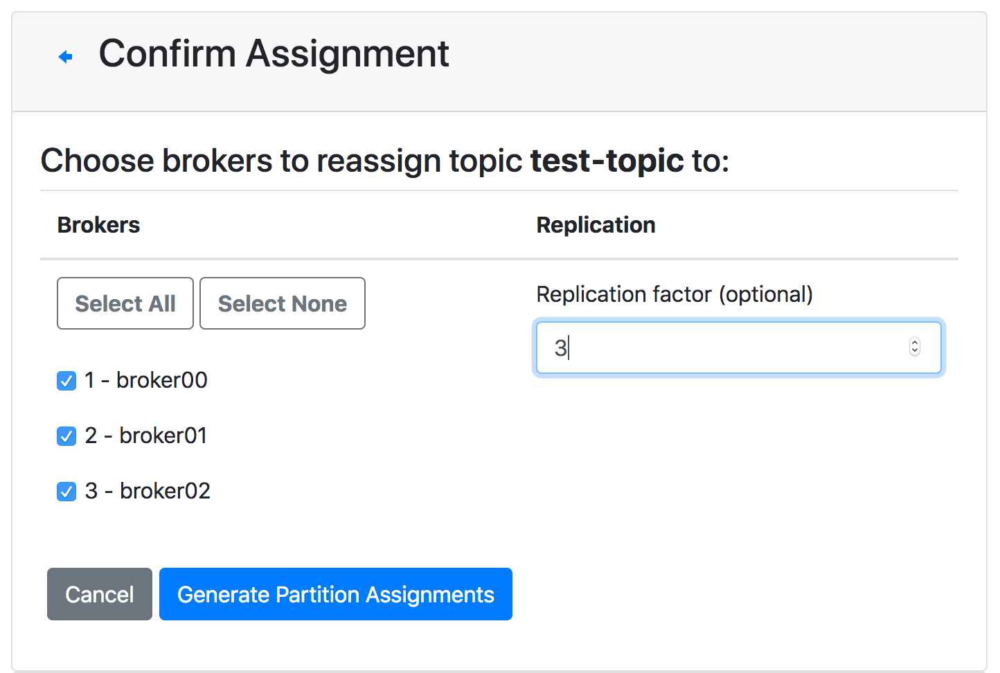
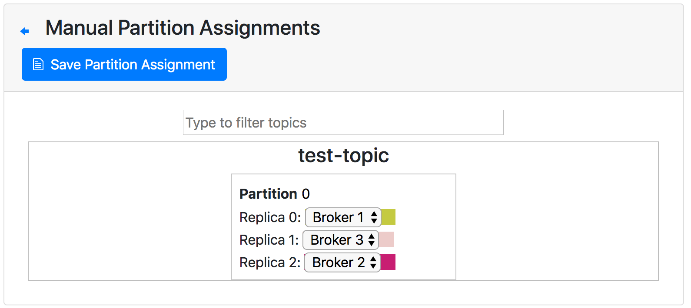
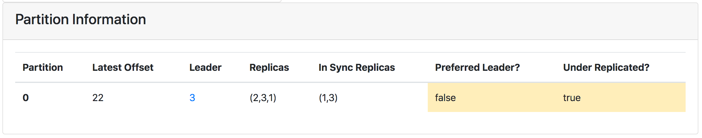
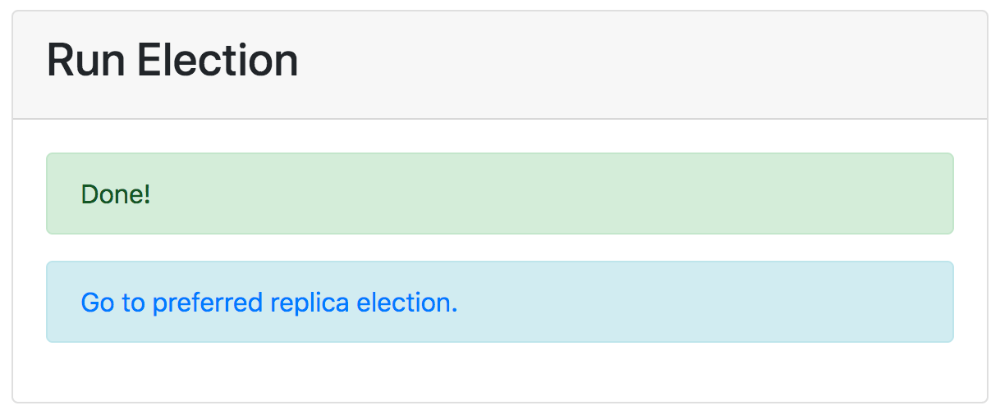
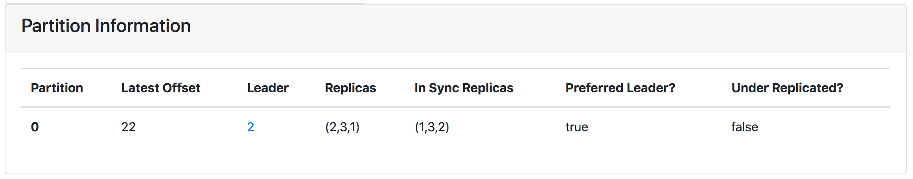

## 들어가며
브로커 장애는 카프카 운영에서 발생하는 가장 흔한 장애다. 
본 글은 브로커의 장애로 인해 발생할 수 있는 현상과 복구하는 `preferred replica election` 방법에 대해 설명한다. 
이전 글([카프카 파티션 리더의 쏠림(skewed) 현상 발생과 해결](https://donald-dh.github.io/donald-dh.github.io/kafka-partition-leader-skewed/))에서 유사한 내용을 적었었다. 
하지만 이전 글은 `leader skewed` 현상을 복구하는 과정에서 발생한 이슈를 중심으로 다뤘다면, 이번 글은 **`partition leadership` 대한 설명**과 브로커 장애 이 후 복구하는 방법인 **`preferred replica election`을 중심**으로 한다. 

## Partition Replica's Role - Leader & Follower
토픽은 파티션 단위로 나눠지고, 파티션은 복제 계수(`replication factor`)에 따라 복제된다. 
복제된 파티션들은 **하나의 `leader`(리더)와 그 외의 `follower`(팔로워)** 형태로 역할을 나눠 각자의 역할을 수행한다. 
리더 파티션은 복제된 파티션 중 유일하게 메세지 쓰기와 읽기 작업을 담당하여 수행하며, 팔로워들은 리더가 쓰기 작업을 완료한 메세지들을 복제(`replication`)한다. 


## Partition Replication
파티션의 복제 설정은 다음과 같이 2가지 방법으로 가능하다. 

* 카프카 쉘 스크립트 `kafka-reassign-partitions`를 이용한 방법
* 카프카 매니저의 Topic 메뉴의 `Reassign Partitions`를 이용한 방법

2가지 방법의 공통점은 **특정 설정을 기반으로 파티션을 브로커에 재분배**하는 요청이다. 쉘 스크립트 방법은 다음과 같이 JSON 파일로 만들어진 파티션 설정을 기반으로 한다.

```json
// 파티션 설정 파일 예시 (json 파일)
{
    "version":1,
    "partitions":[
        {"topic":"test-topic", "partition":0, "replicas":[1,2,3]},
        {"topic":"test-topic", "partition":1, "replicas":[2,1,3]},
        {"topic":"test-topic", "partition":2, "replicas":[3,1,2]} 
    ]
}
```

카프카 매니저도 마찬가지로 `Reassign Partition`을 하기 전에 `Generate Partition Assignment` 혹은 `Manual Partition Assignment`를 해야한다. 
위 사진은 `Generate Partition Assignment` 메뉴 모습이고, 아래는 `Manual Partition Assignment` 메뉴 모습이다.





~~코드를 까본 것이 아니라 예상이지만,~~ Manual 메뉴는 앞서 쉘 스크립트 방식과 유사하게 설정을 만드는 것으로 보인다. 
이와 반대로 Generate 메뉴는 자동적으로 설정을 생성한다. 

복제 설정을 마치고 나면, 복제 파티션들이 리더와 팔로워의 역할로 나뉘어 브로커 클러스터에 흩어진다. 

## Partition Leader's Broker Setting
그렇다면 어느 브로커에 리더 파티션이 지정될까? 
카프카 매니저의 경우 내부적으로 알아서 골고루 파티션을 분배하여 리더가 결정된다. 
하지만 쉘 스크립트 방식은 설정에 사용됐던 JSON 파일의 `"replicas:` 속성에서 가장 첫번째 브로커에 해당 파티션의 리더 파티션이 위치한다. 
즉, 앞선 코드 블럭에서 `test-topic` 토픽 0번 파티션의 리더는 1번 브로커에 위치하게 된다. 

이처럼 **지정된(preferred) 브로커에 위치하는 리더 파티션을 `preferred leader`라고 한다.**

## Broker Down!! 
복제 파티션 중 리더 파티션만 쓰기, 읽기 작업을 수행할 수 있다. 
하지만 어떠한 이유로 브로커가 다운되게 되면, 그 브로커에 위치했던 리더 파티션은 더 이상 작업을 처리할 수 없게 된다. 
이 때, 불능된 리더를 대신 담당할 파티션을 **리더 파티션과 동기화된 복제 파티션 그룹 ISR**(`In Sync Replica`)에서 **선출(election)**하게 된다. 
이러한 장애 대응은 자동적으로 이뤄져 다운타임을 없게 한다. 

참고로 브로커가 다운되더라도 복제 계수를 맞추기 위해 자동적으로 다른 브로커에 복제 파티션을 **생성하지 않는다.**  

## Broker Up!!
다운됐던 브로커의 장애가 해소되어 다시 클러스터에 합류하면 어떻게 될까?
만약 리더가 재선출된 파티션에 메세지가 안 들어왔다면 큰 문제는 없을 것이다. 
오프셋과 같은 정보가 변경되지 않았을테니 말이다. 
하지만 메세지가 1개라도 들어오게 되면 되살아난 브로커에 있던 파티션과 기존 파티션들과의 차이가 생기게 된다. 
즉, 되살아난 브로커는 **ISR에서 제외된 OSR(`Out Sync Replica`)**가 된다.

OSR 상태에서 브로커가 되살아나게 되면, 해당 브로커에 있던 파티션들은 모두 팔로워 파티션 역할로 변경되게 된다. 
그로인해 **이전에 지정한 파티션 복제 설정과 다른 파티션 복제 구성 상태**가 된다. 

## 왜 문제가 될까?
카프카 클러스터는 모두 동일한 성능의 브로커로 구성되지 않을 수 있다. 
그래서 관리자는 파티션 설정을 통해 읽기와 쓰기를 담당하는 리더 파티션의 위치를 관리자가 브로커 성능에 따라 위치시킬 수 있다. 
즉, 성능이 높은 브로커에는 리더 파티션이 많게, 반대로 성능이 낮은 브로커에는 리더 파티션이 적게 파티션을 설정할 수 있다. 
그렇기 때문에 브로커 다운 후 파티션 구성이 기존과 어긋나게 되면 경우에 따라 장애 전이 등 위험한 상황이 발생할 수도 있다(~~개인적인 예상이다~~). 

## preferred replica election
이처럼 기존 설정과 다르게 리더 파티션이 구성된 상황을 복구하기 위한 방법이 `preferred replica election`이다. 
이 방법은 마찬가지로 쉘과 카프카 매니저를 통한 2가지 방법으로 진행할 수 있다. 

쉘을 이용한 방식은 브로커에 포함되어 있는 `kafka-preferred-replica-election.sh` 스크립트를 이용하여 다음과 같이 진행하면 된다. 
`Successfully ...` 부분은 결과에 해당한다.

```sh
root@faa9c20123a0:/# kafka-preferred-replica-election --bootstrap-server broker00:19092
Successfully completed preferred replica election for partitions ...
```

카프카 매니저를 통한 방법은 상단의 `Preferred Replica Election` 메뉴로 진행할 수 있다. 
해당 메뉴에서 `Run Prefered Replica Election` 버튼을 클릭하면 설정에 어긋난 파티션들의 리더를 다시 지정해준다. 
다음 사진은 카프카 매니저를 통해 진행한 과정을 나타낸다.







## 마무리 
글을 통해 파티션의 리더쉽과 관련한 장애 상황을 복구하는 `preferred replica election`을 알아봤다. 
브로커 다운은 카프카에서 ~~그나마~~ 발생할 수 있는 장애 중 가장 대표적인 장애이고, 리더 파티션의 역할을 상당히 중요하므로 `preferred replica election`은 꼭 알아두어야 할 Operation 일 것이다. 
다음은 본문에서 잠시 언급된 `partition reassign`에 대해 자세히 다뤄보고자 한다. 