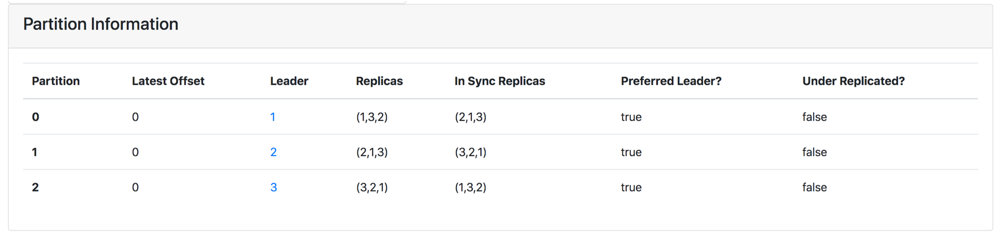

## 들어가며
카프카의 파티션(partition)은 실제로 메세지에 대한 발행과 소비를 담당한다. 
그렇기 때문에 파티션의 수, 브로커 내의 파티션 위치, 파티션 복제 계수 등 파티션에 관련된 설정은 카프카 운영에 있어 가장 중요한 요소이다. 이번 글은 브로커 내에 분포되어 있는 파티션들의 설정을 변경하는 **파티션 재설정(partition reassign)**하는 방법에 대해 다뤄본다.

들어가기에 앞서 **주의사항**이 있다. 
파티션의 재설정은 컨슈머 리밸런싱 등 카프카 내부의 **많은 작업을 유발**한다. 
그렇기 때문에 정상적인 운영 중에는 재설정을 추천하지 않는다. 

## 파티션 재설정
파티션 재설정에는 **파티션의 브로커 위치**와 **복제 계수**를 변경할 수 있다. 
본 글에서는 *브로커 위치를 변경해보는 것을 예제로* 다뤄보겠다. 
파티션 재설정 방법은 다음 2가지 방법으로 할 수 있다.

1. 브로커 스크립트를 이용한 방법
2. 카프카 매니저를 이용한 방법

3개의 브로커로 이뤄진 카프카 클러스터가 있고, `foo` 라는 토픽이 있다고 하자.
우리는 예제로써 이제 이 토픽의 **리더 파티션의 위치를 재설정할 것이다.**

```
Topic:foo	PartitionCount:3	ReplicationFactor:3	Configs:
	Topic: foo	Partition: 0	Leader: 1	Replicas: 1,2,3	Isr: 1,2,3
	Topic: foo	Partition: 1	Leader: 2	Replicas: 2,3,1	Isr: 2,3,1
	Topic: foo	Partition: 2	Leader: 3	Replicas: 3,1,2	Isr: 3,1,2
```

리더 파티션 재설정은 Preferred Replica Election 작업이 뒤 따른다. 
해당 작업은 [앞선 글](https://donald-dh.github.io/kafka-operation-preferred-replica-election/)을 참고하길 바란다.

### 브로커 스크립트를 이용한 파티션 재설정
카프카 브로커에는 다양한 명령과 관련된 스크립트들이 제공된다. 
그 중 `kafka-reassign-partitions`은 파티션 재설정에 관련된 스크립트이다. 
일반적으로 파티션 설정을 명시한 JSON 파일을 인자로 받아 파티션을 재설정한다. 
JSON 파일을 다음과 같이 구성해본다. 

```json
{
    "partitions":
    [
        { "topic": "foo", "partition": 0, "replicas": [3,2,1] },
        { "topic": "foo", "partition": 1, "replicas": [2,1,3] },
        { "topic": "foo", "partition": 2, "replicas": [1,2,3] }
    ],
    "version":1
} 
```

위 JSON 설정 파일은 아래 그림과 같이 **리더** 파티션을 재설정하는 설정이다. 
참고로 `"replicas"`의 값 중 첫번째 브로커 Id에 해당하는 브로커에 리더 파티션이 설정된다.


그럼 다음과 같이 `kafka-reassign-partitions` 스크립트를 통해 재설정해보자.

```
root@3b36ef1aba49:/# kafka-reassign-partitions --zookeeper dc-zookeeper:2181 --reassignment-json-file foo-partition-reassign-v1.json --execute
Current partition replica assignment

{"version":1,"partitions":[{"topic":"foo","partition":2,"replicas":[3,1,2],"log_dirs":["any","any","any"]},{"topic":"foo","partition":1,"replicas":[2,3,1],"log_dirs":["any","any","any"]},{"topic":"foo","partition":0,"replicas":[1,2,3],"log_dirs":["any","any","any"]}]}

Save this to use as the --reassignment-json-file option during rollback
Successfully started reassignment of partitions.
```

옵션 대해 간략한 설명을 하자면..

* `--zookeeper dc-zookeeper:2181` 
  * 클러스터에 등록된 주키퍼를 명시하는 옵션이다. 
  * 기존에는 주키퍼가 클러스터의 메타데이터를 가지고 있기 때문에 **필수적인** 옵션이지만, 아마 차후 주키퍼에 대한 의존성이 없어지면 deprecated 될 옵션이다. (`--bootstrap-server`로 옮겨갈 가능성이 크다.)
* `--reassignment-json-file`
  * 파티션을 재설정할 JSON 파일이다.
* `--execute`
  * 명시된 작업을 실행한다는 옵션이다.

위 작업은 리더 파티션에 대한 설정 값만 변경 하는 작업이었다. 
그렇기 때문에 **해당 작업으로 파티션이 실제로 변경되지는 않는다.** 
그러므로 설정된 리더로 파티션을 재분배해주는 `Preferred Replica Election`을 해줘야 한다. 
자세한 방법은 [앞선 글](https://donald-dh.github.io/kafka-operation-preferred-replica-election/#preferred-replica-election)을 참고하길 바란다.


### 카프카 매니저를 이용한 방법
카프카 매니저로도 간단히 파티션을 재설정할 수 있다. 
우선 `foo` 토픽에 들어가면 다음과 같은 메뉴들을 확인할 수 있다. 
우리가 중심적으로 볼 메뉴는 다음 3가지이다. 


* `Generate Partition Assignments` & `Manual Partition Assignments` (초록색) 
  * 파티션 재설정을 위한 설정을 할 수 있는 메뉴이다.
  * 메뉴의 이름처럼 자동 혹은 수동에 따라 나뉜다.
* `Reassign Partitions` (주황색)
  * 설정 값을 바탕으로 파티션을 재설정하는 메뉴이다.

본 글에서는 리더 파티션의 위치를 직접 변경하는 것을 중심으로 설명하기 때문에 `Manual Partition Assignments` 메뉴를 통해 설정을 수동으로 변경한다. 


주황색으로 표시한 부분으로 각 파티션의 레플리카의 브로커 위치를 변경할 수 있다. 
첫번째 레플리카인 `0`번 레플리카가 리더 레플리카의 위치를 나타낸다. 

추가로 초록색 부분은 각 브로커의 메트릭 정보를 확인할 수 있는 부분이다. 
메트릭을 검색하면 각 브로커의 현재 메트릭을 나타낸다.

모두 설정을 마치면 `Save Partition Assignment`를 클릭하여 설정을 저장한다.
그리고 저장이 완료되면 앞서 토픽 메뉴의 `Reassign Paritions`을 클릭하여 설정을 반영한다. 
성공적으로 변경된 설정이 반영되면 파티션 현황에서 다음과 같이 표시된다. 


실제 파티션 구성과 설정된 파티션 구성이 맞지 않기 때문이다. 
상단 메뉴의 `Preferred Replica Election`을 통해 재설정된 파티션 구성으로 변경한다.


파티션 구성이 실제로 변경된 모습이다.




## 마무리
파티션 재설정(Partition Reassign)하는 방법, 특히 리더 파티션을 변경하는 방법에 대해 살펴봤다. 
파티션 재설정은 파티션 구성 변경 외에도 복제 계수 또한 변경할 수 있다. 
관련된 글은 고승범님이 Popit에 작성하신 [Kafka 운영자가 말하는 Replication Factor 변경](https://www.popit.kr/kafka-%EC%9A%B4%EC%98%81%EC%9E%90%EA%B0%80-%EB%A7%90%ED%95%98%EB%8A%94-replication-factor-%EB%B3%80%EA%B2%BD/) 글을 참고하길 바란다.

다음 글로는 컨슈머 리벨런싱에 대해 다뤄보겠다. 

